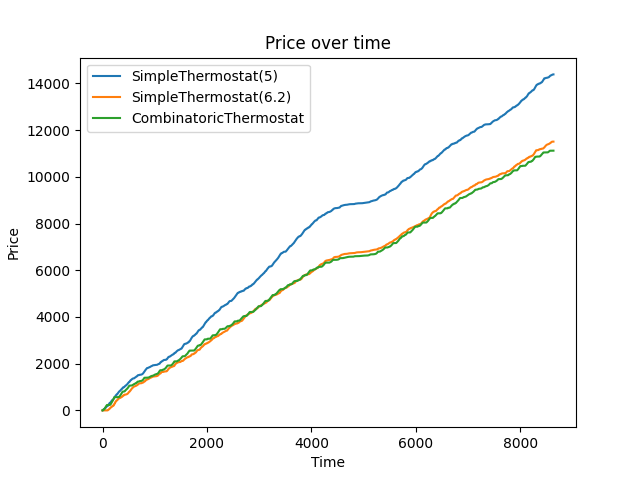

<p align="center">
    
</p>

<h1 align="center">Energibesparende styring af kølerum</h1>

<p align="center">
    <a href="https://python.org"></a>
    <a href="#"></a>
    <a href="#"></a>
    <a href="https://github.com/DNIIBOY/AAU/blob/main/LICENSE"></a>
    <a href="https://github.com/DNIIBOY/AAU"></a>
</p>

## Table of Contents
1. [Systemdiagram](#systemdiagram)  
2. [Abstract Base Classes](#abstract-base-classes)  
3. [Kompressor](#kompressor)  
4. [CoolingRoom implementering](#coolingroom-implementering)  
5. [Temperatur](#temperatur)  
6. [Termostater](#termostater)  
7. [Monte Carlo Simulering](#monte-carlo-simulering)  
8. [Tests](#tests)

## Systemdiagram
Dette system gør brug af objektorienteret programmering (encapsulation, inheritance, polymorphism & abstraction).
Her gøres brug af abstract base classes og dependency injection som værktøjer til at skabe et modulært system, der giver mulighed for at eksperimentere med forskellige termostatløsninger, og simplificerer koden.

Klasserne er sammensat som på figuren herunder (hvis ikke den virker som forventet i light mode, så klik på den.)
<a href="https://app.eraser.io/workspace/cKjpT73Y5mQKIRYPADsD/preview?elements=d0-hJSrv-A1qdEQsqviBmA&type=embed"></a>

## Abstract Base Classes
På systemdiagramet kan det ses at der gøres brug af dependecy injection til blandt andet at ændre hvilken thermostat systemet bruger, da man bare skal ændre hvilket objekt der bliver sat som termostat i `CoolingRoom` klassen.
Alle termostaterne inheriter fra klassen `Thermostat`, som er defineret således:

```python
class Thermostat(ABC):
    def __init__(self) -> None:
        self.cooling_room: CoolingRoom | None = None

    def register(self, room: "CoolingRoom") -> None:
        """
        Register the thermostat in the room
        :param room: CoolingRoom to register the thermostat
        :return: None
        """
        assert isinstance(
            room, CoolingRoom
        ), "The thermostat can only be registered in a CoolingRoom"
        self.cooling_room = room

    @abstractmethod
    def recommended_compressor_state(self, i: int) -> bool:
        """
        Return the recommended state of the compressor
        :param i: The current iteration step
        :return: True if the compressor should be on, False otherwise
        """
        if not self.cooling_room:
            raise ValueError("The thermostat is not registered in any room")
```
Her bliver alt der er tilfældes mellem alle termostater defineret.
Man kan se på første linje at `Thermostat` klassen inhertier fra `ABC` som er pythons indbyggede "Abstract Base Class", der beskriver klassen som "abstract", og giver adgang til at bruge `@abstractmethod` decoratoren.
Dette er meget lig andre objektorienterede programmeringssprog, der også har et `abstract` keyword, som fortæller at denne klasse ikke skal instantieres, men bare er et "blueprint" til de klasser der faktisk skal bruges.

For eksempel kan den simpleste termostat skrives med kun 7 linjer kode:
```python
class SimpleThermostat(Thermostat):
    def __init__(self, target_temp: int = 5) -> None:
        super().__init__()
        self.target_temp = target_temp

    def recommended_compressor_state(self, i: int) -> bool:
        super().recommended_compressor_state(i)
        return self.cooling_room.temp > self.target_temp
```
Her inheriter `SimpleThermostat` fra `Thermostat` og får derfor alt koden fra tidligere med.
Derudover tilføjes en target temperatur for termostaten, og `recommended_compressor_state` implementeres, så kompressoren tændes når temperaturen overstiger den tidligere definerede target temperatur.

## Kompressor
Kompressoren er implementeret som en klasse, der kan holde styr på sit eget energiforbrug, samt dens påvirkning på temperaturen.
Constructoren tager elpriserne, "køleværdien" af kompressoren $T_{komp} = -5$ samt startværdien (tændt/slukket) som argumenter.
```python
class Compressor:
    def __init__(
        self,
        electric_prices: pd.Series,
        temp: float = -5,
        is_on: bool = False
    ) -> None:
        self.temp = temp
        self.is_on = is_on
        self.cost = 0

        self._off_factor = 0
        self._on_factor = 8e-6

        self._electric_prices = electric_prices

    def consume_electricty(self, i: int) -> None:
        """
        Consume electricity and update the total price, if the compressor is on
        :param i: The current iteration step
        :return: None
        """
        if self.is_on:
            self.cost += float(self._electric_prices.iloc[i])

    @property
    def temp_factor(self) -> float:
        return self._on_factor if self.is_on else self._off_factor
```
Når `consume_electricty` kaldes, opdateres den totale udgift som kompressoren har haft. Hvis kompressoren er slukket ændres udgiften selvfølgelig ikke.
`Compressor` klassen har også en property `temp_factor`, som returnerer kompressorens nuværende effekt på totaltemperaturen, afhængigt af om den er tændt eller ej ($C_2$)

## CoolingRoom implementering
Selve `CoolingRoom` er selvfølgelig også implementeret som en klasse, der har alle de dependencies defineret i systemdiagramet.
Derudover kan man også definere starttemperaturen for rummet, som har defaultværdien $T[0] = 5$, og temperaturen udenfor kølerummet bliver defineret som en privat attribut $T_{rum} = 20$.
```python
class CoolingRoom:
    def __init__(
        self,
        compressor: Compressor,
        thermostat: "Thermostat",
        food: Food,
        door: Door,
        temp: float = 5,
    ) -> None:
        self.compressor = compressor
        self.thermostat = thermostat
        self.thermostat.register(self)
        self.food = food
        self.door = door

        self.temp = temp

        self._ambient_temp = 20
```
`CoolingRoom` klassen har en metode `run`, som håndterer hvad der sker hver gang der går 1 cyklus af simuleringen. Metoden kan ses her:
```python
def run(self, i: int) -> None:
    """
    Run the cooling room for the current iteration step
    :param i: The current iteration step
    :return: None
    """
    self.door.shuffle()
    self.compressor.is_on = self.thermostat.recommended_compressor_state(i)
    self.update_temp()
    self.compressor.consume_electricty(i)
    self.food.deteriorate(self.temp)
```
Her sker alle de ting, som skal ske ved hvert trin i simuleringen.
Argumentet `i` er det nummeret på det trin i simuleringen vi er på lige nu, dette er nødvendigt fordi elpriserne skifter mellem hvert trin.
Først kaldes `shuffle` på døren, som har en P = 10% chance for at døren åbnes, ellers lukkes den.
Herefter sættes kompressorens nuværende stadie til den anbefalede værdi af den installerede termostat.
Til sidst udregnes den nye temperatur i lokalet bestemmes, og udgifterne beregnes.

## Temperatur
Temperaturen bestemmes ved:

$$
T[n] = T[n-1] + C_1(T_{rum}-T[n-1])+C_2(T_{komp}-T[n-1]))\Delta t
$$

Denne temperatur kan deles op i 3 faktorer:

$$
T_{før} = T[n-1]
$$
$$
T_{luft} = C_1(T_{rum}-T[n-1]) \Delta t
$$
$$
T_{køler} = C_2(T_{komp}-T[n-1]) \Delta t
$$
$$
T[n] = T_{før} + T_{luft} + T_{køler}
$$

I koden ser det sådan ud:

```python
def update_temp(self, delta_t: int = 300) -> None:
    """
    Update the temperature of the room
    :param i: The current iteration step
    :param delta_t: Amount of time passed since last update
    :return: None
    """
    previous = self.temp
    ambient = self.door.temp_factor * (self._ambient_temp - self.temp) * delta_t
    cooler = self.compressor.temp_factor * (self.compressor.temp - self.temp) * delta_t

    self.temp = previous + ambient + cooler
```
Her er `self.door.temp_factor` det samme som $C_1$, og `self.compressor.temp_factor` er $C_2$, som beskrevet tidligere.

## Termostater
Som vist i systemdiagramet er der blevet udviklet mange forskellige termostater:
* `SimpleThermostat`: Tænder når temperaturen overstiger en konstant værdi (5 grader)
* `HysteresisThermostat`: Tænder når temperaturen overstiger en konstant værdi, men med en lille forsinkelse (en hysterese) 
* `LocalAverageThermostat`: Tænder når elprisen er lavere end gennemsnittet indenfor en kort periode
* `FutureMinAverageThermostat`: Tænder når elprisen er den laveste inden for den nærmeste fremtid
* `CombinatoricSmartThermostat`: Kombinere `LocalAverageThermostat` og `FutureMinAverageThermostat`

Den totale pris over tid for disse termostater kan ses på denne figur:
<p align="center"></p>

Her kan man se at `FutureMinAverageThermostat` og `CombinatoricSmartThermostat` klarer sig bedst.
Der er dog en lille ændring man kan lave til `SimpleThermostat`, som gør at den klarer sig meget bedre.
Ved hjælp af trial-and-error (`optimize.py`) kan man se at ved at ændre `target_temp` fra 5 til ~6.2, klarer den sig meget bedre.
<p align="center"></p>

Her kan det ses at den nye `SimpleThermostat` klarer sig næsten lige så godt som `CombinatoricSmartThermostat`, og endda nogle gange bedre.

## Monte Carlo Simulering
For at få et resultat hvor tilfældighed (dørens tilfældige tilstand) ikke har lige så stor effekt, kan Monte Carlo Simulering bruges.
Her køres koden mange gange i streg, og gennemsnittet bruges.
Dette er implementeret meget enkelt i `monte_carlo.py`, og 1000 iterationer er kørt på `SimpleThermostat` og `CombinatoricSmartThermostat`.

| Monte Carlo 1000 Iterationer | SimpleThermostat(6.2) | CombinatoricSmartThermostat |
|------------------------------|-----------------------|-----------------------------|
| Gennemsnitlig Total Pris     | 11469 DKK             | 11713 DKK                   |

Begge værdier under 12.000 DKK, og kan derfor godt overholde budgetet, dog klarer den simple termostat sig bedre end den kombinatoriske.
Hvis man kigger på en kurve der sammenligner temperaturen i kølerummet med de forskellige termostater, kan man faktisk få en forklaring på dette. 
<p align="center"></p>

Her kan man se at temperaturen der holdes af `CombinatoricSmartThermostat` er meget lavere end den, der holdes af `SimpleThermostat`,
og denne forskel kan være med til at forklare forskellen i el-forbruget.

## Tests
For at sikre at alting virker som forventet er der skrevet unittests.
Der er nogle få doctests (fordi de er et krav😥), og nogle rigtige unittests i `test.py` filen.
Unittests virker ved at man kalder noget kode, og derefter undersøger variable, for at sikre sig at værdierne er som forventet.
Et eksempel på en simpel unittest kan ses her:
```python
def test_consume_no_electricity(self):
    self.compressor.is_on = False
    self.compressor.consume_electricty(0)
    self.compressor.consume_electricty(1)
    self.assertEqual(self.compressor.cost, 0, "Consumed electricity when off")
```
Her kaldes `consume_electricty` på et `Compressor` objekt, mens kompressoren er slukket, og der sikres at den ikke har brugt penge på el.
